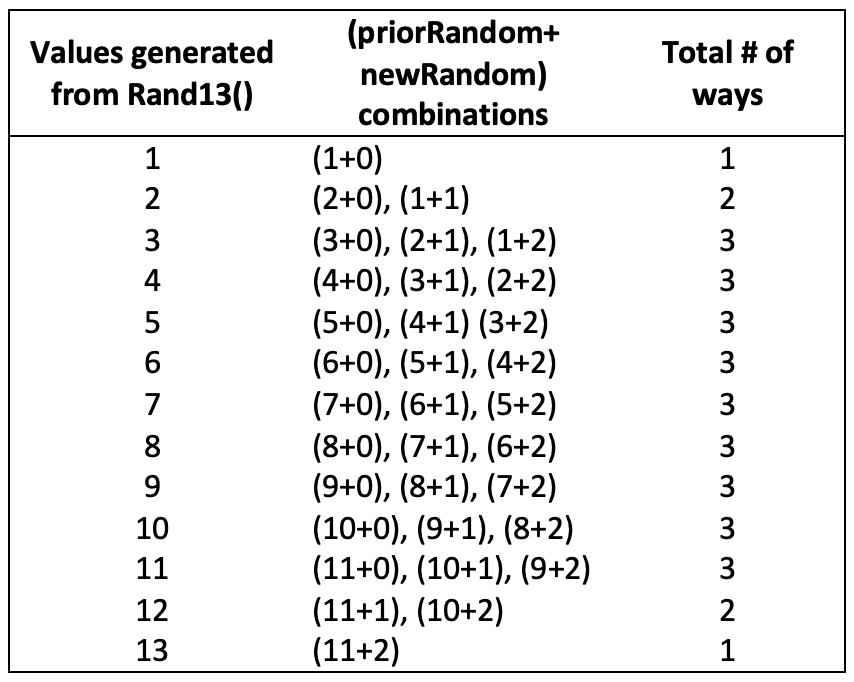
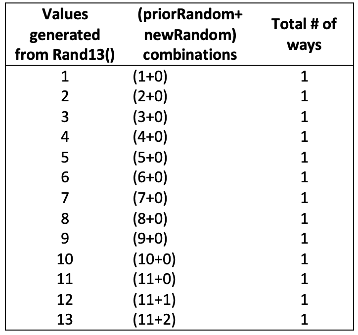

# Coding-Challenge

## Link to Web Application:
https://skay97.github.io/coding-challenge/

## Note: 
I apologize for the thorough documentation. My intention was to create documentation that provides sufficient insight into my thought process and can explain why I chose what I chose in different areas of this procedure. I hope this proves useful.

## First Assumption of Solution:
```
function rand11() {
  var random = Math.floor(Math.random() * 11) + 1;
  return random;
}
function rand13() {
  var priorRandom = rand11();
  var newRandom = Math.floor(Math.random() * 3);
  return priorRandom + newRandom;
}
rand13();
```
When first faced with the challenge my initial thought was to store the number generated by the *rand11* function into the *priorRandom* variable and add that to the *newRandom* variable to supply myself with values from 1-13.  The *newRandom* variable would store the value of a randomly generated number between 0-2 using ```Math.floor(Math.random()*3)```. This was all done in the *rand13* function. However, after calculating the probabilities of each individual number I quickly learned that this was a very naive attempt and the function would not result in equal probabilities as there were various ways of creating specific numbers, i.e., there was only 1 way to create the number 1 using this function and 2 ways to create a number 2. The number 1 could only be achieved by generating a 1 from the *priorRandom* variable and adding it to a 0 generated from the *newRandom* variable. However, for the number 2, if both *priorRandom* and *newRandom* generated a 1, then the final number would result in a 2. Additionally, we could get the number 2 if *priorRandom* generated a 2 and was added to a 0 generated from the *newRandom*. Thus, the number of ways to create 1-13 using this initial method varied and is as follows:



Seeing this I realized I had to modify this function to try and create a method that would allow each number to have the same amount of ways of being created. It made sense to me that controlling the number of ways for each outcome would be easiest by establishing 1 method of being created. This then led to my next assumption of the solution

## Second Assumption of solution:
```
function rand11() {
  var random = Math.floor(Math.random() * 11) + 1;
  return random;
}

function rand13() {
  var priorRandom = rand11();
  var newRandom = Math.floor(Math.random() * 3);

  if (priorRandom < 11) {
    newRandom = 0;
  }
  return priorRandom + newRandom;
}
rand13();
```
With this new function I was able to obtain a uniform method of distribution for each output. I did this by using an if statement. Thus, whenever *priorRandom* was less than 11, the *newRandom* variable would be assigned 0. In this way adding whatever number stored in the *priorRandom* variable with a 0 would return the original number unaltered. Alternatively, when the *priorRandom* generated an 11, it could be added to *newRandom* which would still have a number randomly generated from 0-2 within it. The methods for all the numbers to be created are as follows:



As shown above, the numbers 12 and 13 would only be created when 1 or 2 was added to 11. And 11 could only be created when 0 was added to it. However, the hurdle I came across with this solution was that the probability of numbers 11-13 was skewed due to prior manipulation. The numbers 1-10 were being generated with a probability of 1/11 from the *rand11* function, but 11, 12 and 13 were being generated with a probability of (1/11)* (1/3). Consequently, this again did not produce equal probabilities overall, regardless of there being one way to create each number.

After scratching this method entirely, I now provide the final solution.

## Final solution:
```
function rand11() {
  var random = Math.floor(Math.random() * 11) + 1;
  return random;
}

function rand13() {
  var newRandom = 11 * rand11() + rand11() - 11;
  return newRandom < 118 ? (newRandom % 13) + 1 : rand13();
}
rand13();
```

In this function I multiplied 11 by the number generated from the rand11 function, added it to another number generated from the rand11 function and finally subtracted it by 11:
```11 * rand11() + rand11() - 11```.
This produced a range from 1-121, without altering the probability. Once I received this range of numbers, I used the modulus operator to get reminders from 0-12. Lastly, I added a 1 to my newly produced numbers in order to increase the range of possible outputs to 1-13. However, this would produce a total of 10 ways to get the numbers 2-5, and 9 ways to get the remaining numbers. In order to fix this, the modulus and addition of 1 could only be performed on values originally created for numbers less than 118 in order to limit all possibilities to 9. Thus, if the number was greater than 117, recursion was applied, and the function was run again to generate a new number.

This process took me multiple hours over the course of a few days to finalize the logic, the design for the web application I have used this function in, and finally, the documentation. This was truly a delightful experience that was both mentally fulfilling and thought-provoking.
